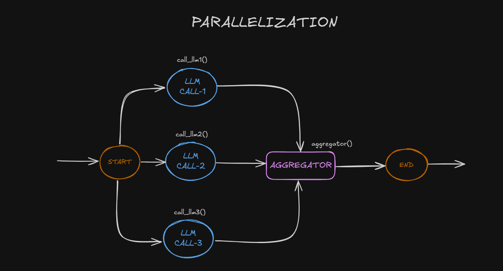

## LANGCHAIN-AGENT (WORKFLOWS)

### 1) Usage

```bash
git clone https://github.com/buraketmen/langchain-agent.git
cd langchain-agent
python -m venv venv
venv\Scripts\activate
pip install -r requirements.txt
```

### 2) Structure

You can run all the examples by running the following command.

```bash
python <example-name>/main.py
# e.g. python prompt-chaining/main.py
```

#### 2.1) Prompt Chaining


#### 2.2) Parallelization



#### 2.3) Routing


