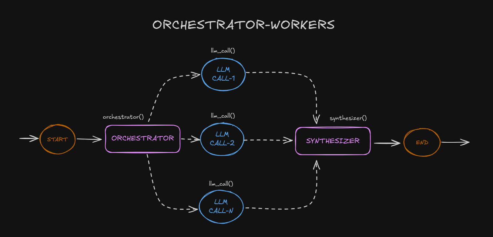
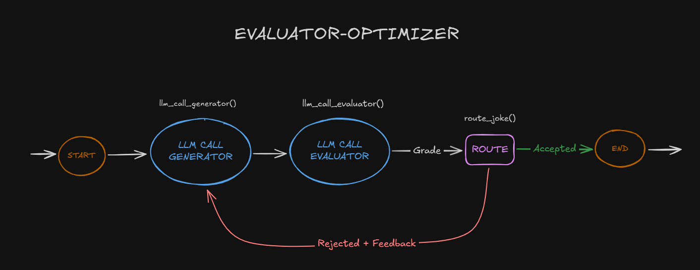

## LANGCHAIN-AGENT (WORKFLOWS)

**Agent** can be defined in several ways. Some people define agents as fully autonomous systems that operate independently over extended periods, using various tools to accomplish complex tasks. Others use the term to describe more prescriptive implementations that follow predefined workflows.

- **Workflows** are systems where LLMs and tools are orchestrated through predefined code paths.
- **Agents**, are systems where LLMs dynamically direct their own processes and tool usage, maintaining control over how they accomplish tasks.

### 1) Usage

You can use any LLM that supports tool calling. However, If you want to use a local LLM, I recommend using **[ollama](https://ollama.com/)**. All examples leverage the **qwen2:7b** model. After installing Ollama, you can retrieve the model by executing the following command.

```bash
ollama pull qwen2:7b
```

Clone the repository and install the required dependencies to run the examples.

```bash
git clone https://github.com/buraketmen/langchain-agent.git
cd langchain-agent
python -m venv venv
venv\Scripts\activate
pip install -r requirements.txt
```

### 2) Patterns

Here are some of the patterns you can use to build your own agent and workflows.

1. [Prompt Chaining](./prompt-chaining/main.py)
2. [Parallelization](./parallelization/main.py)
3. [Routing](./routing/main.py)
4. [Orchestrator-worker](./orchestrator-worker/main.py)
5. [Evaluator-optimizer](./evaluator-optimizer/main.py)
6. [Agent](./agent/main.py)

You can run all the examples by running the following command.

```bash
python <example-name>/main.py
# e.g. python prompt-chaining/main.py
```

#### 2.1) Prompt Chaining

Prompt chaining decomposes a task into a sequence of steps, where each LLM call processes the output of the previous one. You can add programmatic checks (see "GATE in the diagram below) on any intermediate steps to ensure that the process is still on track.

This workflow is ideal for situations where the task can be easily and cleanly decomposed into fixed subtasks. The main goal is to trade off latency for higher accuracy, by making each LLM call an easier task.


#### 2.2) Parallelization

LLMs can sometimes work simultaneously on a task and have their outputs aggregated programmatically. This workflow, parallelization, manifests in two key variations:

- **Sectioning:** Breaking a task into independent subtasks run in parallel.
- **Voting:** Running the same task multiple times to get diverse outputs.

Parallelization is effective when the divided subtasks can be parallelized for speed, or when multiple perspectives or attempts are needed for higher confidence results. For complex tasks with multiple considerations, LLMs generally perform better when each consideration is handled by a separate LLM call, allowing focused attention on each specific aspect.


#### 2.3) Routing

Routing classifies an input and directs it to a specialized followup task. This workflow allows for separation of concerns, and building more specialized prompts. Without this workflow, optimizing for one kind of input can hurt performance on other inputs.

Routing works well for complex tasks where there are distinct categories that are better handled separately, and where classification can be handled accurately, either by an LLM or a more traditional classification model/algorithm.


#### 2.4) Orchestrator-worker

In the orchestrator-workers workflow, a central LLM dynamically breaks down tasks, delegates them to worker LLMs, and synthesizes their results.

This workflow is well-suited for complex tasks where you can’t predict the subtasks needed (in coding, for example, the number of files that need to be changed and the nature of the change in each file likely depend on the task). Whereas it’s topographically similar, the key difference from parallelization is its flexibility—subtasks aren't pre-defined, but determined by the orchestrator based on the specific input.



#### 2.5) Evaluator-Optimizer

In the evaluator-optimizer workflow, one LLM call generates a response while another provides evaluation and feedback in a loop.

This workflow is particularly effective when we have clear evaluation criteria, and when iterative refinement provides measurable value. The two signs of good fit are, first, that LLM responses can be demonstrably improved when a human articulates their feedback; and second, that the LLM can provide such feedback. This is analogous to the iterative writing process a human writer might go through when producing a polished document.



#### 2.6) Agent

Agents can handle sophisticated tasks, but their implementation is often straightforward. They are typically just LLMs using tools based on environmental feedback in a loop. It is therefore crucial to design toolsets and their documentation clearly and thoughtfully.

Agents can be used for open-ended problems where it’s difficult or impossible to predict the required number of steps, and where you can’t hardcode a fixed path. The LLM will potentially operate for many turns, and you must have some level of trust in its decision-making. Agents' autonomy makes them ideal for scaling tasks in trusted environments.


### 3) References

- [Workflows](https://langchain-ai.github.io/langgraph/tutorials/workflows/)
- [Building Effective Agents](https://www.anthropic.com/research/building-effective-agents)
